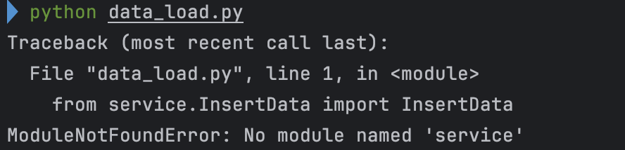
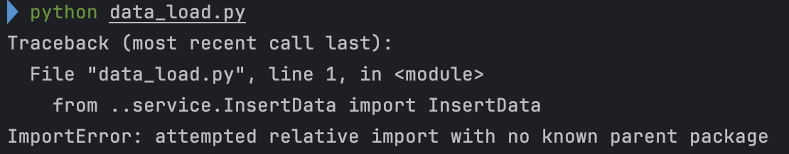

## AS-IS
모듈 임포트 문제

1. 기초 전략
   - 코드 가독성을 위해 모듈을 최대한 나누려 하였으나
   - 계속되는 참조 오류로 인해 개선 필요
2. 개선 방안 
   - 메인 API만을 실행시키는 `main.py`와 데이터 수집을 실행시키는 `data_load.py` 로 분리 
## TO-BE
1. 1차 이전 완료 
   - `service`, `api`, `data` 로 구분 
-----

## 이후 문제 
1. `airflow` 리버스 프록시 매핑시 문제 
- 추후 서술 예정
### 트리구조 

```bash
.
├── ./LICENSE
├── ./README.md
├── ./Redis
│   ├── ./Redis/Dockerfile
│   └── ./Redis/docker-compose-vectorstore.yaml
├── ./airflow
│   ├── ./airflow/Dockerfile
│   ├── ./airflow/data
│   └── ./airflow/docker-compose-airflow.yaml
├── ./nginx
│   ├── ./nginx/Dockerfile
│   ├── ./nginx/docker-compose-nginx.yaml
│   └── ./nginx/nginx.conf
├── ./service
│   ├── ./service/__pycache__
│   ├── ./service/api
│   ├── ./service/config
│   ├── ./service/main.py
│   ├── ./service/model
│   └── ./service/requirements.txt
└── ./venv
    ├── ./venv/bin
    ├── ./venv/include
    ├── ./venv/lib
    └── ./venv/pyvenv.cfg

```

## 캡쳐


~~모듈 임포트 실패~~



~~기존 참조 범위를 벗어난 오류~~

