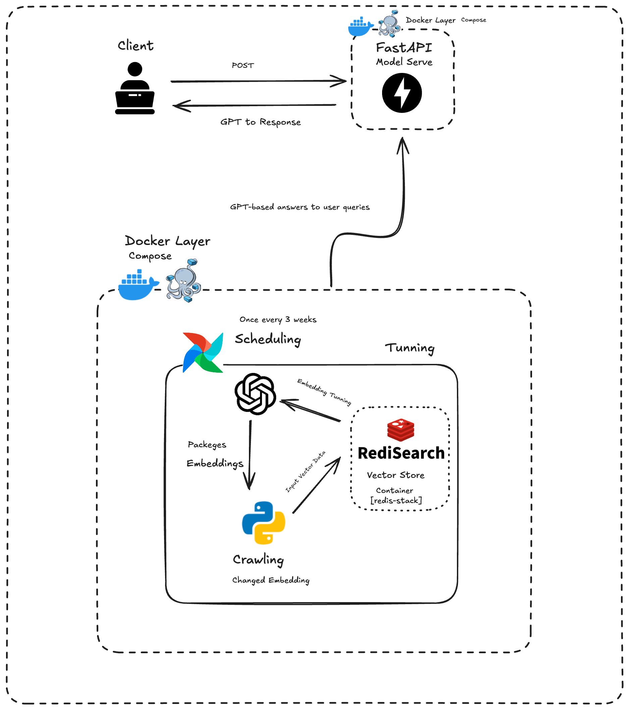

# Sever-Model

- 모델서버 

## 현재 구축현황 
1. FastAPI Router 구축 
2. 데이터 매니징 → `data_load.py`
3. 서비스 및 모델 `service` 패키지

## 트리구조

```bash
├── api
│   ├── __init__.py
│   ├── __pycache__
│   └── router
├── data
├── data_load.py
├── main.py
├── service
│   ├── Authentication.py
│   ├── InsertData.py
│   ├── Models.py
│   ├── RedisManager.py
│   ├── __init__.py
│   └── __pycache__
└── venv
    ├── bin
    ├── include
    └── lib
```

## 시스템 아키텍처 



- 참고사항 
  - `RediSearch` 내에서 벡터 스토어를 사용하기 때문에 `RediSearch`로 사용 
